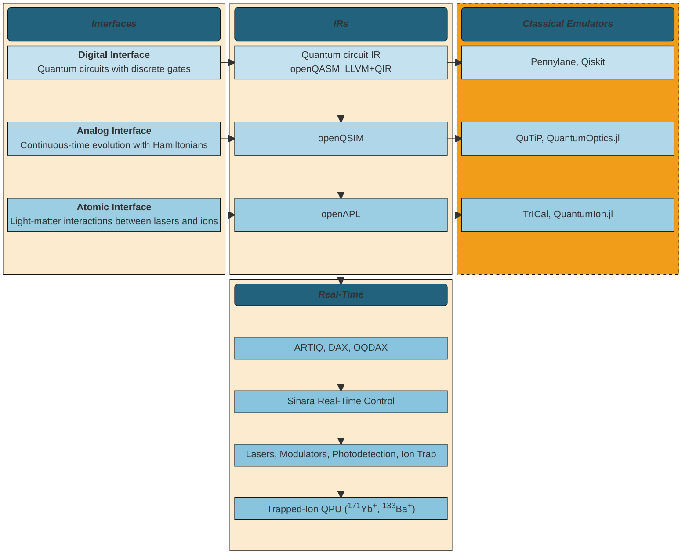

# 

<h2 align="center">
    Open Quantum Design: Cloud
</h2>

[](https://docs.openquantumdesign.org/open-quantum-design-cloud)
[](https://pypi.org/project/oqd-cloud)
[](https://github.com/OpenQuantumDesign/oqd-cloud/actions/workflows/pytest.yml)

[](https://opensource.org/licenses/Apache-2.0)
[](https://github.com/astral-sh/ruff)


## What's Here
This repository contains the software needed to submit jobs to a remote, cloud server for classical simulations of quantum programs.
In addition, it provides a Docker script to self-host a simulation server of the OQD emulator backends.

## Installation
```bash 
pip install oqd-cloud
```

To install locally for development or launching a Docker container server:

```bash
git clone https://github.com/OpenQuantumDesign/oqd-cloud.git
pip install .
```

To start the simulation server, ensure Docker is installed on the machine, navigate to the `docker` folder, and run,
```bash
cd oqd-cloud/docker
docker compose up -d
```

To serve the documentation, 
```bash
pip install .[docs]
mkdocs serve
```

### Where in the stack

The tools in this repository allow for self-hosting a server to run
quantum programs on classical emulators, highlighted in the stack diagram in red. 
A client can specify a quantum program, submit it as a job to the self-hosted server,
and retrieve the emulation results.

Currently, the analog layer backend is supported.